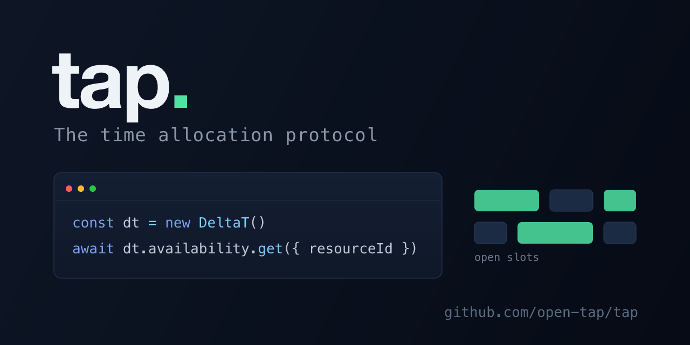

<p align="center">
  
</p>

<p align="center">
  <a href="https://www.npmjs.com/package/@open-deltat/client"></a>
  <a href="https://github.com/open-deltat/tap/actions/workflows/ci.yml"></a>
  <a href="LICENSE"></a>
  <a href="demo/LICENSE"></a>
  <a href="https://delt.at"></a>
</p>

---

TAP is the Time Allocation Protocol, an open standard for scheduling, booking, and availability: one shared way to describe time and ask "what is free, and can I claim it before someone else does?", so any app, service, or agent speaks it the same way.

This repo is TAP in practice: its typed TypeScript SDK (`@open-deltat/client`) and a set of demo apps (seat maps, calendars, capacity pools, recurring schedules, and hold-to-book flows with live updates). The SDK points at [deltat](https://github.com/open-deltat/deltat), the database built to speak TAP, which treats availability as collision detection on the Unix-time number line. The protocol does not depend on it: any backend that implements TAP can be talked to the same way.

## Install

```bash
npm install @open-deltat/client
# or: bun add @open-deltat/client
```

## SDK

`@open-deltat/client` is a typed interface to deltat:

- **Resources** - hierarchical create / update / delete / get
- **Rules** - batch `create(items[])`, update, delete, get
- **Bookings** - batch `create(items[])`, cancel, get with an optional `{start, end}` window
- **Holds** - place, commit (atomic hold-to-booking conversion), release, get with an optional `{start, end}` window
- **Availability** - single-resource and combined multi-resource queries
- **Events** - real-time LISTEN/NOTIFY subscriptions
- **`expandRecurrence()`** - turn a recurring pattern (days of week, time range, date range, exclusions) into concrete rule segments, DST-safe in an explicit IANA `timeZone` (default UTC)

```ts
import { DeltaT, expandRecurrence } from "@open-deltat/client";

const dt = new DeltaT({ host: "localhost", port: 5433 });

const room = await dt.resources.create({ name: "Room A" });

// Open weekdays 9 to 5 for the first quarter, as concrete rules. Wall-clock times are
// interpreted in the given IANA timeZone (default "UTC") and stay correct across DST.
const segments = expandRecurrence({
  daysOfWeek: [1, 2, 3, 4, 5],
  startTime: "09:00",
  endTime: "17:00",
  fromDate: "2025-01-01",
  toDate: "2025-03-31",
  timeZone: "Europe/Berlin",
});
await dt.rules.create(segments.map((s) => ({ resourceId: room.id, ...s })));

const slots = await dt.availability.get({
  resourceId: room.id,
  start: Date.now(),
  end: Date.now() + 86_400_000,
});
```

> deltat's current transport is the PostgreSQL wire protocol, a transitional choice. A v2 framed protocol with HTTP and MCP adapters is planned (see deltat's `docs/REQUIREMENTS.md`, PROTO-01/02). The typed API above is built to outlast that swap.

## Demos

| Demo | What it shows |
|------|----------------|
| **Airline** | Split-screen dual-client seat booking with real-time holds |
| **Theater** | Single-venue seat map with section pricing |
| **Stadium** | Large-venue seat selection with timed events |
| **Calendar** | Resource management with weekly and daily views and recurring rules |
| **Scheduling** | Multi-resource availability finder with threshold modes |
| **Availability** | Calendly-style owner and booker flow with hold-to-confirm |
| **Restaurant** | Party size to floor plan to time slot to reservation |
| **Parking** | Multi-floor garage with zone grids and duration-based booking |

Every demo uses a WebSocket for live updates. The hold-based ones follow a connection-lifecycle pattern: opening a socket places a hold, sending `{type: "confirm"}` books it atomically, and closing the socket releases it.

## Run the demos

Requires [Bun](https://bun.sh).

```bash
cd demo
bun install
bun dev      # starts deltat and the Next.js dev server
```

The dev script installs deltat via `cargo install` if it is missing or out of date.

## Repository

```
packages/client/     @open-deltat/client, the TypeScript SDK over deltat's wire protocol
packages/examples/   @open-deltat/examples, the booking modules (components + "use server" actions) shared by every app
packages/shared/     date and week helpers shared by the apps
demo/                Next.js gallery of the interactive examples above
calendar/            standalone booking app with env-based owner login
```

## Shared examples package

The booking demos are not welded to the demo site. Every example, its React components, its `"use server"` actions, the deltat client, the seed and booking helpers, and the shared booker UI, lives in one workspace package: `@open-deltat/examples`. Two kinds of app consume the same package with no duplication:

- **`demo/`** renders them as a gallery ([delt.at](https://delt.at)). It stays a pure gallery: it shows the examples, it never becomes one of them.
- **A standalone app** (see below) imports the same modules as its own booking surface and adds its own chrome, login, and tenant.

The package ships raw source that carries `"use client"` / `"use server"` directives, so a consuming Next.js app must transpile it:

```ts
// next.config.ts
export default { transpilePackages: ["@open-deltat/examples"] };
```

Then import a whole example, or the pieces beneath it, by subpath:

```ts
import Gym from "@open-deltat/examples/gym";                    // a full example component
import { Stage } from "@open-deltat/examples/components/stage"; // shared booker UI
import { dt } from "@open-deltat/examples/lib/deltat";          // the deltat client
import { enabledExampleIds } from "@open-deltat/examples/config";
```

## Deploying a standalone app with env-based auth

`calendar/` is the reference for a single-tenant deployable app: a public booking page plus an owner dashboard behind a login. It needs no user database and no identity provider. The owner credentials, the cookie-signing secret, and the deltat tenant all come from the environment, so a deployment is one image plus its env.

**Login model.** One operator signs in with `CAL_USER` / `CAL_PASS`. On success the app sets an `httpOnly` session cookie signed with `CAL_SECRET` (HMAC-SHA256, constant-time verified, with a 7-day server-enforced expiry so a copied cookie still ages out). There is no user table. Every authenticated Server Action calls `requireSession()` as its first line, because a Server Action is an independent POST endpoint that a layout redirect does not protect.

**Environment.**

| Variable | Purpose |
|---|---|
| `CAL_USER`, `CAL_PASS` | owner login credentials |
| `CAL_SECRET` | HMAC key that signs the session cookie |
| `CAL_DISPLAY_NAME`, `CAL_SLUG` | public business name and booking path (`/book/<slug>`) |
| `DELTAT_HOST`, `DELTAT_PORT`, `DELTAT_PASSWORD` | the deltat instance to talk to |
| `DELTAT_DB` | this deployment's tenant, its isolated data |

**Production safety.** In production the app refuses to authenticate while `CAL_PASS`, `CAL_SECRET`, or `DELTAT_PASSWORD` are still the in-repo defaults (`assertProductionSecrets()`), so a deploy can never ship a forgeable session or a public database password.

**Example.** Build a standalone image from `calendar/` (Next server output, the way `demo/` does), then run it with this deployment's env and tenant:

```yaml
services:
  fitflow:
    image: your-registry/tap-calendar:latest   # built from calendar/
    environment:
      CAL_USER: owner
      CAL_PASS: ${CAL_PASS}          # from a secret store, never committed
      CAL_SECRET: ${CAL_SECRET}      # e.g. openssl rand -hex 32
      CAL_DISPLAY_NAME: "FitFlow Studio"
      CAL_SLUG: fitflow
      DELTAT_HOST: deltat
      DELTAT_PORT: "5433"
      DELTAT_DB: fitflow             # this tenant's isolated store
      DELTAT_PASSWORD: ${DELTAT_PASSWORD}
    ports: ["3000:3000"]
```

Point `DELTAT_DB` at a distinct database name per deployment and deltat provisions an isolated store on first connect, so two operators never share data. Generate `CAL_SECRET` with `openssl rand -hex 32` and keep it in your secret store, never in the compose file.

## License

Licensed by directory:

- **SDK and shared helpers** (`packages/`): [MIT](LICENSE). Use them anywhere, in any project, open or closed. This is what the npm package ships under.
- **Applications** (`demo/`, `calendar/`): [AGPL-3.0-or-later](demo/LICENSE). They are meant to be self-hosted and deployed; if you run a modified version as a network service, you must offer that version's source under the same license.

GitHub shows the root MIT license in the sidebar because it only reads the top-level file; the AGPL applies to the app directories regardless, via their own `LICENSE` files.
